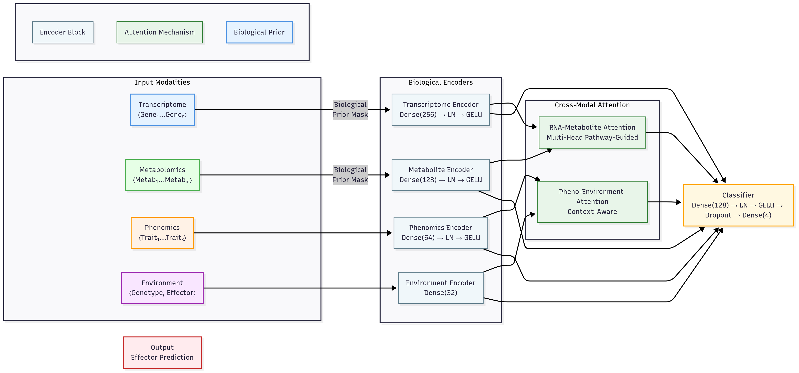

# Article
Multimodal Learning Reveals Plants' Hidden Sensory Integration Logic

# CoMM-BIP: Multimodal Integration with Biological Priors

[](https://doi.org/10.5281/zenodo.16281076)
[](https://opensource.org/licenses/MIT)



Predict pathogen effectors by integrating transcriptomic, metabolomic, and phenomic data with biologically informed machine learning.

## Features
- **Biologically guided attention**: Prioritizes known gene-metabolite interactions.
- **State-of-the-art performance**: 0.98 F1 score on effector prediction.
- **Interpretable**: SHAP analysis and attention visualization.

## Quick Start
```bash
git clone https://github.com/yourusername/CoMM-BIP.git
pip install -r requirements.txt
python src/train.py --data_dir ./data
